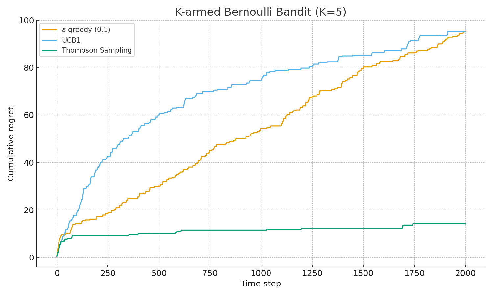
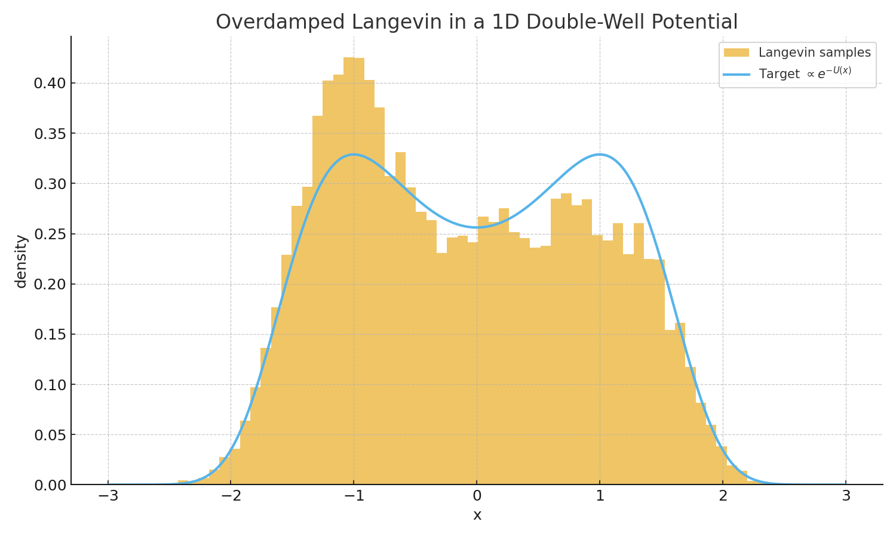
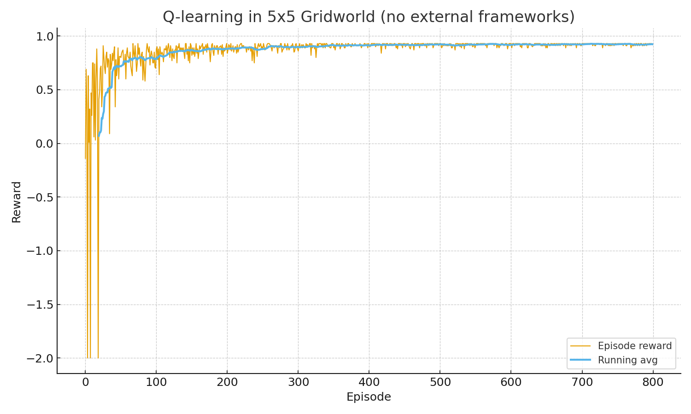

# Summer School 2025 — Minimal Reproductions

[](https://www.python.org/downloads/release/python-3130/)
[](LICENSE)

This repository contains small, self-contained Python scripts and Jupyter notebooks I reproduced after attending the **Hi! Paris Summer School 2025**.  
The goal is to consolidate my learning in **bandits, reinforcement learning, and Langevin dynamics** through hands-on coding exercises.

---

## Contents

- **Multi-Armed Bandits**  
  [Script](bandits_epsilon_ucb_thompson.py) | 
  [](https://colab.research.google.com/github/md-naim-hassan-saykat/summer-school-2025-reproductions/blob/main/bandits_epsilon_ucb_thompson.ipynb)  
  Implements and compares:
  - ε-greedy
  - UCB1
  - Thompson Sampling  
  Produces a plot of **cumulative regret** across time steps.

- **Langevin Dynamics**  
  [Script](langevin_sampling_double_well.py) | 
  [](https://colab.research.google.com/github/md-naim-hassan-saykat/summer-school-2025-reproductions/blob/main/langevin_sampling_double_well.ipynb)  
  Uses overdamped Langevin sampling in a 1D double-well potential.  
  Produces a histogram compared against the theoretical density.

- **Reinforcement Learning (Q-learning)**  
  [Script](rl_gridworld_qlearning.py) | 
  [](https://colab.research.google.com/github/md-naim-hassan-saykat/summer-school-2025-reproductions/blob/main/rl_gridworld_qlearning.ipynb)  
  Q-learning on a 5×5 gridworld with simple rewards.  
  Produces a plot of episode reward with running average.

---

## Requirements  
Tested with Python 3.13. Dependencies are pinned in `requirements.txt` for reproducibility.

First, create and activate a virtual environment:

```bash
python3 -m venv .venv
source .venv/bin/activate    # macOS/Linux
# For Windows (PowerShell):
# .venv\Scripts\Activate
```

## Then install dependencies:

```bash
pip install --upgrade pip setuptools wheel
pip install -r requirements.txt
```

## How to Run
```bash
python bandits_epsilon_ucb_thompson.py
python langevin_sampling_double_well.py
python rl_gridworld_qlearning.py
```
## Results
> The plots are automatically saved as `.png` files in the repository folder. 
Below are the figures generated by the scripts (they’ll appear after running).

### Multi-Armed Bandits (Cumulative Regret)
[](bandit_cumulative_regret.png)

- Compares **ε-greedy (0.1)**, **UCB1**, and **Thompson Sampling** on a K-armed Bernoulli bandit (K=5).
- Expected behavior: **UCB1** and **Thompson** should reduce regret faster than ε-greedy.

### Langevin Dynamics (Double-Well Sampling)
[](langevin_double_well.png)

- Overdamped Langevin sampler in a **double-well potential**.
- Histogram of samples vs. the target density \( \propto e^{-U(x)} \); good overlap indicates correct sampling.

### Q-Learning (5×5 Gridworld)
[](gridworld_qlearning_rewards.png)

- **Q-learning** with ε-greedy exploration toward a goal state.
- Plot shows per-episode reward with a running average; upward trend indicates learning.

---

**Note:** All figures above are generated automatically by the scripts.  
If they don’t appear, simply re-run the code as described in **How to Run**. 

## Related Report
The full written report can be found here: Summer School Report 2025

## License
This project is licensed under the terms of the MIT license (see LICENSE).

## Acknowledgment
These reproductions were created as part of my learning during the Hi! Paris Summer School 2025.
They complement my written report submitted for academic credit.
